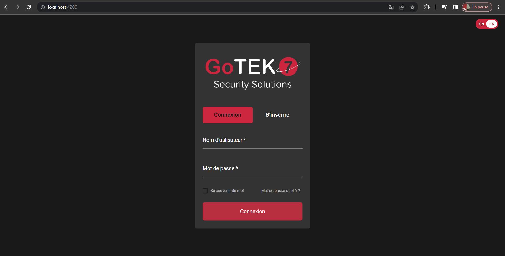

# **Accès à la plateforme GoTK7**

Pour **accéder** à la plateforme de gestion de balises de GoTEK7, rendez-vous sur ce lien : [www.fakelien.fr](www.fakelien.fr). Ce lien vous redirigera automatiquement vers la page d'inscription.

## **Inscription**

Veuillez **compléter le formulaire d'inscription** en fournissant les informations requises :

- Votre nom d'utilisateur
- Votre adresse e-mail
- Votre mot de passe sécurisé.

Avant de soumettre le formulaire, **veuillez vérifier** quelques points :

- Assurez-vous que votre _adresse e-mail_ soit valide, car elle sera utilisée pour la réception des rapports journaliers des balises GPS et pour la récupération de votre compte si nécessaire.
- Vérifiez que votre _mot de passe_ soit correctement renseigné.

!!! warning "Attention"

    Pour que l'inscription soit validée, votre adresse e-mail doit être professionnelle et celle de l'entreprise.

## **Connexion**

**Complétez le formulaire** de connexion en fournissant :

- Votre nom d'utilisateur
- Votre mot de passe.

!!! note "Note"

    Vous avez la possibilité de cocher la case "**Se souvenir de moi**". Cela pré-remplira automatiquement le champ "nom d'utilisateur" lors de vos prochaines visites sur la plateforme.

En cas d'**erreurs** :

- Vérifiez que votre nom d'utilisateur soit correctement renseigné.

- De même, vérifiez que votre mot de passe soit correctement renseigné.

Si les erreurs persistent, vous pouvez cliquer sur "Mot de passe oublié".
