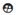

Le tableau de bord offre une vue exhaustive de toutes les informations liées aux balises GPS de l'entreprise, centralisées de manière intuitive pour une gestion efficace.

## **Filtres**

Les filtres, situés à côté de la barre de recherche, vous permettent de restreindre les données en fonction de la dernière communication, du type du tracker, et du statut. Cette fonctionnalité offre une flexibilité supplémentaire pour répondre à vos exigences spécifiques.

## **Tri**

Un système de tri est à votre disposition pour organiser les données selon vos besoins :

- IMEI
- Numéro de série
- Dernière communication
- Firmware
- Tension
- Type

Il vous suffit de **cliquer** sur le titre correspondant pour classer les informations à votre convenance.

!!! tip "Tips"

    Vous avez la possibilité de cumuler les deux options proposées par la plateforme : le filtre et le tri. Vous pouvez par exemple trier par ordre croissant le voltage des modèles GT7 uniquement.

## **Boutons Cliquables**

Sur le côté droit du tableau de bord, trois colonnes présentent des icônes cliquables, ouvrant de nouvelles fenêtres avec des informations détaillées.

### **Informations Clients**

Cliquez sur l'icône `supervised_user_circle`  pour consulter les informations clients détaillées :

- Nom
- Email
- Téléphone
- Adresse
- Dernière recharge du traceur
- Date d'achat du traceur
- Compagnie
- Langage
- Type de batterie du traceur

!!! info "Infos"

    Sur cette pop-up ci, vous avez la possibilité de modifier ou d'ajouter certaines informations du client.

### **Localisation du Traceur**

Cliquez sur l'icône `map`  pour accéder à la page de localisation du traceur.

### **Modification sur le Traceur**

Cliquez sur l'icône `infos`  pour accéder à la page de modification des informations du traceur.

Sur cette pop-up, suivez simplement ces étapes :

1. Cliquez sur les champs que vous souhaitez modifier.
2. Sélectionnez le nouveau paramétrage.
3. Appuyez sur valider.

!!! question "Nouveau paramétrage"

    Si vous souhaitez ajouter de nouveaux paramètres, veuillez en informer l'équipe informatique qui se chargera de les intégrer.

_Note au professeur : je ne dispose plus de traces ou d'images concernant cette partie._
